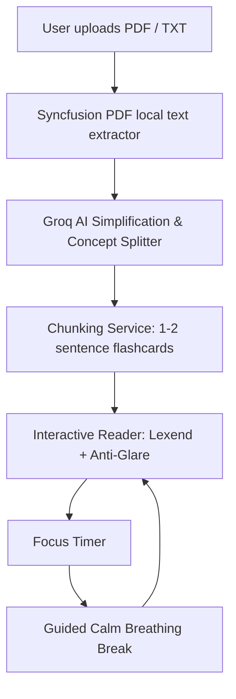

# KeepUp! 

> **Adaptive, distraction-free learning powered by AI — designed specifically for children and learners with ADHD and Dyslexia.**

[](https://flutter.dev)
[](https://dart.dev)
[](https://groq.com)

---

## Table of Contents
- [About the Project](#-about-the-project)
- [Key Features](#-key-features)
- [How It Works](#-how-it-works)
- [Tech Stack](#-tech-stack)
- [Project Structure](#-project-structure)
- [Installation Guide](#-installation-guide)
  - [Prerequisites](#1-prerequisites)
  - [Clone the Repository](#2-clone-the-repository)
  - [Install Dependencies](#3-install-dependencies)
  - [Configure Environment Variables](#4-configure-environment-variables)
  - [Run the Application](#5-run-the-application)
- [Building for Production](#-building-for-production)
  - [Web](#web)
  - [Android (APK & App Bundle)](#android-apk--app-bundle)
  - [Desktop (Windows)](#windows-desktop)
  - [iOS](#ios)
- [Testing & Quality Assurance](#-testing--quality-assurance)
- [Security Guidelines](#-security-guidelines)
- [Troubleshooting](#-troubleshooting)

---

## About the Project

Traditional educational materials are often structured as dense, multi-page walls of text. For neurodivergent learners, this format poses major hurdles:
- **ADHD Challenges:** Difficulty sustaining attention across long paragraphs, sensory overload, and frequent cognitive fatigue.
- **Dyslexia Challenges:** Visual crowding, letter inversion/swapping, Scotopic Sensitivity (glare fatigue from harsh white backgrounds), and slow tracking.

**KeepUp!** bridges this gap by transforming complex documents into an **adaptive, micro-learning experience**. It combines dyslexia-friendly typography and glare-free warm palettes with the **"One Screen, One Idea"** paradigm, breaking study sessions into bite-sized flashcards with built-in Pomodoro timers and guided calming breaks.

---

## Key Features

### 1. AI-Powered Material Chunking
- Upload reading materials in **PDF or TXT** format.
- Powered by high-speed **Groq AI**, the system extracts key concepts and transforms them into concise, single-idea cards without losing context or clarity.

### 2. Dyslexia-Optimized Typography & Visuals
- **Lexend Typography:** Utilizes the evidence-based *Lexend* font family engineered to expand character apertures and reduce visual crowding.
- **Anti-Glare Palettes:** Replaces harsh monitor white with soothing background tones such as **Warm Peach**, **Warm Cream**, **Soft Amber**, and **Soft Mint**.
- **Adjustable Spacing:** Customizable font sizes (16–28px), line height, and letter tracking to suit individual reading preferences.

### 3. ADHD Focus Sessions (Pomodoro Technique)
- **One Screen, One Idea:** Each screen displays only one concept at a time, completely eliminating peripheral distractions.
- **Visual Timers:** Gentle countdown timer rings with tactile duration presets (5, 10, 15, or 20 minutes) to foster achievable milestones.
- **Intuitive Gestures:** Supports swipe gestures across touchscreens, trackpads, and mouse drag, along with accessible navigation arrows.

### 4. Guided Calm Breaks
- Integrated breathing intervals with glowing concentric ring animations ("Sunset Glow").
- Step-by-step visual breathing pacing to reset focus and prevent cognitive burnout.

---

## How It Works



---

## Tech Stack

| Layer | Technology |
|---|---|
| **Framework** | [Flutter](https://flutter.dev) (Dart SDK `^3.12.2`) |
| **State Management** | [Flutter Riverpod](https://riverpod.dev) (`NotifierProvider`) |
| **Routing** | [GoRouter](https://pub.dev/packages/go_router) |
| **AI Processing** | [Groq Cloud API](https://groq.com) (High-throughput inference) |
| **PDF Extraction** | [Syncfusion Flutter PDF](https://pub.dev/packages/syncfusion_flutter_pdf) |
| **File Picker** | [File Picker](https://pub.dev/packages/file_picker) |
| **Typography** | [Google Fonts (Lexend)](https://pub.dev/packages/google_fonts) |
| **Local Storage** | [Shared Preferences](https://pub.dev/packages/shared_preferences) |

---

## Project Structure

```text
lib/
├── app/
│   ├── app.dart                   # Root MaterialApp configuration
│   ├── router.dart                # GoRouter route declarations
│   └── theme.dart                 # Warm Orange design system & theme data
├── core/
│   ├── constants/                 # Design colors, spacing & typography constants
│   ├── services/
│   │   ├── ai_service.dart        # Groq API client & prompt engineering
│   │   ├── chunking_service.dart  # Sentence splitting & card generator
│   │   ├── demo_data_service.dart # Preloaded sample learning materials
│   │   ├── storage_service.dart   # SharedPreferences persistence layer
│   │   └── text_cleaner_service.dart # Markdown, HTML & whitespace sanitizer
│   └── widgets/                   # Reusable atomic UI components
├── features/
│   ├── calm_break/                # Guided breathing & pause screen
│   ├── focus_session/             # Session setup & duration selector
│   ├── home/                      # Material dashboard, stats & search
│   ├── material_import/           # File drag-and-drop & AI processing screen
│   ├── onboarding/                # Welcome screen & live personalization
│   └── reader/                    # Tactile flashcard reader & timer
├── models/                        # Domain models (LearningMaterial, UserPreferences, etc.)
└── providers/                     # Riverpod state providers
```

---

## Installation Guide

Follow these steps to set up and run KeepUp! on your local development machine.

### 1. Prerequisites
Ensure you have the following installed on your system:
- **[Flutter SDK](https://docs.flutter.dev/get-started/install)** (Version 3.22.0 or newer recommended)
- **[Dart SDK](https://dart.dev/get-dart)** (bundled with Flutter)
- **[Git](https://git-scm.com/)**
- An IDE with Flutter extensions: **VS Code** or **Android Studio**
- A free **[Groq Cloud Account](https://console.groq.com)** to obtain an API key for the AI processing feature.

Verify your environment by running:
```bash
flutter doctor
```

### 2. Clone the Repository
```bash
git clone https://github.com/nabathnm/hologiw.git
cd hologiw
```

### 3. Install Dependencies
Fetch all required Dart and Flutter packages:
```bash
flutter pub get
```

### 4. Configure Environment Variables
KeepUp! keeps secrets safe using Flutter's compile-time `--dart-define-from-file` mechanism.

1. Copy the sample environment file:
   ```bash
   # On macOS/Linux:
   cp env.example.json env.json

   # On Windows (PowerShell):
   Copy-Item env.example.json env.json
   ```

2. Open `env.json` and insert your Groq API key:
   ```json
   {
     "GROQ_API_KEY": "gsk_your_actual_groq_api_key_here"
   }
   ```
   > **Note:** `env.json` is included in `.gitignore` to prevent credentials from ever being committed to GitHub.
   >
   > *Tip:* You can also set or change your Groq API Key anytime directly within the app under **Pengaturan (Settings)**.

### 5. Run the Application

#### Option A: Using Visual Studio Code (Recommended)
A preconfigured `.vscode/launch.json` is included in the project.
1. Open the project folder in VS Code.
2. Select **Run and Debug** (`Ctrl+Shift+D` or `Cmd+Shift+D`).
3. Choose **KeepUp (Development)** and press **`F5`**.

#### Option B: Using the Flutter CLI
Specify the environment configuration file using `--dart-define-from-file`:

```bash
# Run on default connected device (Chrome, Windows, or connected mobile device):
flutter run --dart-define-from-file=env.json

# Run specifically on Google Chrome:
flutter run -d chrome --dart-define-from-file=env.json

# Run specifically on Windows Desktop:
flutter run -d windows --dart-define-from-file=env.json

# Run on an Android Emulator:
flutter run -d android --dart-define-from-file=env.json
```


